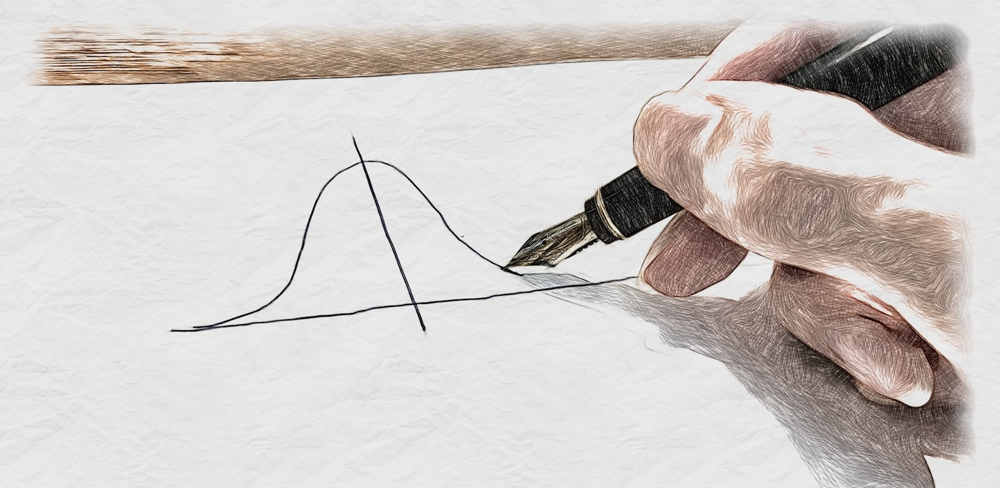

# Probability Density Function Drawing Competition

  

It is very difficult to draw a probability density function such as a normal distribution in freehand. It is not human work to draw curves with inflection points in mind, or to draw the convergence at infinity! Now, all you statisticians, show me your skills at drawing probability density functions. Good luck!

## How to play
Competitions can be played on [this site](https://atsushi-green.github.io/PDF-compete/).

- The score is out of 100 points.
- Click (tap if you are using a smartphone) the mouse, and without releasing it (drag), continue drawing.
When you release the mouse (finger), the score will be calculated.
- If you do not start from the left side of the screen and draw to the right side of the screen, the score will not be calculated.
- Please draw from left to right. If you start drawing from right to left, you will not be scored.
- There is no time limit. You may draw slowly (but do not release the mouse or finger).
- Intervals where the probability density is zero will not be scored. (No points will be deducted for drawing them, but you do not have to draw the interval where x is negative in the exponential distribution, etc.).
- If you start drawing again, it will be automatically restarted under the same conditions.
- Each time you click on the “ランダム出題モード” ("Random Exercise Mode") button, the probability density function you draw will change (try drawing it with attention to the parameters of the distribution).

# Score Calculation
The scores are calculated by 3 methods. 

1. Optimal Transport: calculating optimal transport distance between the curve you drew and the true probability density function.
2. Absolute Error: comparing the area between the curve you drew and the true probability density function.
3. Kullback-Leibler divergence: calculating the kullback-leibler divergence between the curve you drew and the true probability density function.